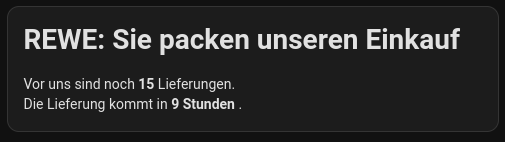
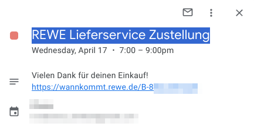

# REWE Lieferdienst Updates auf dem Home Assistant Dashboard

Wir bestellen gerne beim REWE Lieferdienst. Damit wir auf einen Blick sehen, wann die Lieferung kommt haben wir am Tag der Lieferung diese Karte auf dem Tablet:



Dazu läuft der Code dieses Repos. Er sucht in unserem gemeinsamen Google Kalender nach einem Eintrag "REWE Lieferservice Zustellung". In diesen Eintrag fügen wir immer einen Link auf die Statusseite ein:



Im Home Assistant haben wir diese Einstellung:

```yaml
rest:
  - scan_interval: 300
    resource: http://.../ # URL dieses Docker containers eingtragen
    sensor:
      - name: rewe
        value_template: "{{ value_json.status }}"
        json_attributes:
          - status
          - customersBefore
          - expectedArrivalIntervalStart
```

Und diese Karte:

```yaml
type: markdown
content: >-
  

  # REWE: {{ { "CREATED": "Bestellt", "NOT_FIXED": "Sie packen unseren Einkauf", "COMMISSION_STARTED": "Sie packen unseren Einkauf", "LOADED": "Unser Einkauf ist gepackt", "COMMISSIONED": "Unser Einkauf ist gepackt", "STARTED": "Unser Einkauf ist auf dem Weg zu uns", "POSTPONED": "Unser Einkauf ist auf dem Weg zu uns", "APPROACHING_POSTPONED": "Unser Einkauf ist gleich da", "APPROACHING": "Unser Einkauf ist gleich da", "ARRIVED": "Die Lieferung ist an unserem Haus angekommen", "DELIVERED": "Unser Einkauf ist bei uns", "CANCELLED": "Heute bekommen wir unseren Einkauf leider nicht mehr" }.get(states('sensor.rewe'), "Unbekannt") }}

  Vor uns sind noch **{{ state_attr("sensor.rewe", "customersBefore") }}** Lieferungen.
  Die Lieferung kommt in **{{ int(timeUntil.seconds / 60) }} Minuten{{ int(timeUntil.seconds / 3600) }} Stunden**.
```
